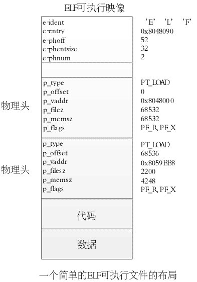

# 【背景】理解ELF文件格式

由于本章的project中，bootloader会访问ELF(Executable and linking format)格式的ucore，并把ucore加载到内存中。所以，在这里我们需要简单介绍一下ELF文件格式，以帮助我们理解ucore的整个编译、链接和加载的过程，特别是希望读者对ld链接器用到的链接地址（Link address）和操作系统相关的加载地址（Load address）有更清楚的了解。

ELF文件格式是Linux系统下的一种常用目标文件(object file)格式，有三种主要类型。可重定位文件(relocatable file)类型和共享目标文件(shared object file)类型在本实验中没有涉及。本实验的OS文件类型是可执行文件(executable file)类型，这种ELF文件格式类型提供程序的进程映像，加载程序的内存地址描述等。

简单地说，bootloader通过解析ELF格式的ucore，可以了解到ucore的代码段（机器码）/数据段（初始化的变量）等在文件中的位置和大小，以及应该放到内存中的位置；可了解ucore的BSS段（未初始化的变量，具体内容没有保存在文件中）的内存位置和大小。这样bootloader就可以把ucore正确地放置到内存中，便于ucore的正确执行。

这里只分析与本章相关的ELF可执行文件类型。ELF的执行文件映像如下所示：

ELF的文件头包含整个执行文件的数据结构elf header，描述了整个执行文件的组织结构。其定义在proj2/3中的elf.h文件中：

    struct elfhdr {
        uint32_t e_magic;     // must equal ELF_MAGIC
        uint8_t e_elf[12];
        uint16_t e_type;      // 1=relocatable, 2=executable, 3=shared object, 4=core image
        uint16_t e_machine;   // 3=x86, 4=68K, etc.
        uint32_t e_version;   // file version, always 1
        uint32_t e_entry;     // entry point if executable
        uint32_t e_phoff;     // file position of program header or 0
        uint32_t e_shoff;     // file position of section header or 0
        uint32_t e_flags;     // architecture-specific flags, usually 0
        uint16_t e_ehsize;    // size of this elf header
        uint16_t e_phentsize; // size of an entry in program header
        uint16_t e_phnum;     // number of entries in program header or 0
        uint16_t e_shentsize; // size of an entry in section header
        uint16_t e_shnum;     // number of entries in section header or 0
        uint16_t e_shstrndx;  // section number that contains section name strings
    };

program header描述与程序执行直接相关的目标文件结构信息，用来在文件中定位各个段的映像，同时包含其他一些用来为程序创建进程映像所必需的信息。可执行文件的程序前面部分有一个program header结构的数组， 每个结构描述了一个“段”（segment）或者准备程序执行所必需的其它信息。目标文件的 “段”（segment） 包含一个或者多个 “节区”（section） ，也就是“段内容（Segment Contents）” 。program header仅对于可执行文件和共享目标文件有意义。可执行目标文件在elfhdr的e_phentsize和e_phnum成员中给出其自身程序头部的大小。程序头部的数据结构如下表所示：

    struct proghdr {
        uint32_t p_type;   // loadable code or data, dynamic linking info,etc.
        uint32_t p_offset; // file offset of segment
        uint32_t p_va;     // virtual address to map segment
        uint32_t p_pa;     // physical address, not used
        uint32_t p_filesz; // size of segment in file
        uint32_t p_memsz;  // size of segment in memory (bigger if contains bss）
        uint32_t p_flags;  // read/write/execute bits
        uint32_t p_align;  // required alignment, invariably hardware page size
    };

**链接地址（Link address）和加载地址（Load address）**

Link Address是指编译器指定代码和数据所需要放置的内存地址，由链接器配置。Load Address是指程序被实际加载到内存的位置。一般由可执行文件结构信息和加载器可保证这两个地址相同。Link Addr和LoadAddr不同会导致：

    直接跳转位置错误
    直接内存访问(只读数据区或bss等直接地址访问)错误
    堆和栈等的使用不受影响，但是可能会覆盖程序、数据区域
 
也存在Link地址和Load地址不一样的情况（如动态链接库）。在proj3中，bootloader和ucore的链接地址和加载地址是一致的。

