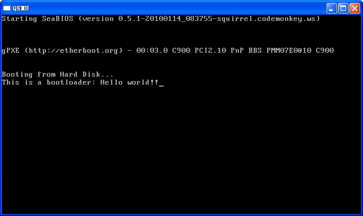

# 显示字符的toy bootloader

## 实验目标

操作系统是一个软件，也需要通过某种手段加载并运行它。在这里我们将通过另外一个更加简单的软件-bootloader来完成这些工作。为此，我们需要完成一个能够切换到x86的保护模式并显示字符的bootloader，为将来启动操作系统做准备。proj1提供了一个非常小的bootloader，整个bootloader的大小小于512个字节，这样才能放到硬盘的主引导扇区中。
> 这里对x86的保护模式不必太在意，后续会进一步讲解

通过分析和实现这个bootloader，读者可以了解到：
* 与操作系统原理相关
 * I/O设备管理：设备管理的基本概念，涉及简单的信息输出
 * 内存管理：基于分段机制的存储管理，x86的实模式/保护模式以及切换到保护模式的方法
* 计算机系统和编程
 * 硬件
   * PC加电后启动bootloader的过程
   * 通过串口/并口/CGA输出字符的方法
 * 软件
   * bootloader的文件组成
   * 编译运行bootloader的过程
   * 调试bootloader的方法
   * 在汇编级了解栈的结构和处理过程

## proj1概述 

### 实现描述
proj1实现了一个简单的bootloader，主要完成的功能是初始化寄存器内容，完成实模式到保护模式的转换，在保护模式下通过PIO方式控制串口、并口和CGA等进行字符串输出。

### 项目组成
[要点（非OSP）：bootloader的编译生成过程]
lab1中包含的第一个工程小例子是proj1：一个可以切换到保护模式并显示字符串的bootloader。proj1的整体目录结构如下所示：
```
    proj1 /
    |-- boot
    |   |-- asm.h
    |   |-- bootasm.S
    |   `-- bootmain.c
    |-- libs
    |   |-- types.h
    |   `-- x86.h
    |-- Makefile
    `-- tools
        |-- function.mk
        |-- gdbinit
        `-- sign.c

    3 directories, 9 files
```
其中一些比较重要的文件说明如下：
* bootasm.S ：定义并实现了bootloader最先执行的函数start，此函数进行了一定的初始化，完成了从实模式到保护模式的转换，并调用bootmain.c中的bootmain函数。
* bootmain.c：定义并实现了bootmain函数实现了通过屏幕、串口和并口显示字符串。
* asm.h：是bootasm.S汇编文件所需要的头文件，主要是一些与X86保护模式的段访问方式相关的宏定义。
* types.h：包含一些无符号整型的缩写定义。
* x86.h：一些用GNU C嵌入式汇编实现的C函数（由于使用了inline关键字，所以可以理解为宏）。
* Makefile和function.mk：指导make完成整个软件项目的编译，清除等工作。
* sign.c：一个C语言小程序，是辅助工具，用于生成一个符合规范的硬盘主引导扇区。
* gdbinit：用于gdb远程调试的初始命令脚本

从中，我们可以看出bootloader主要由bootasm.S和bootmain.c组成，当你完成编译后，你会发现这个bootloader只有区区的3百多字节。下面是编译运行bootloader的过程。

>【提示】bootloader是一个超小的系统软件，在功能上与我们一般的应用软件不同，主要用于硬件简单初始化和加载运行操作系统。在编写bootloader的时候，需要了解它所处的硬件环境（比如它在内存中的起始地址，它的储存空间的位置和大小限制等）。而这些是编写应用软件不太需要了解的，因为操作系统和编译器帮助应用软件考虑了这些问题。

### 编译运行

**【实验  编译运行bootloader】**

在proj1下执行make，在proj1/bin目录下可生成一个ucore.img。ucore.img是一个包含了bootloader或OS的硬盘镜像，通过执行如下命令可在硬件虚拟环境 qemu中运行bootloader或OS：
```
  make                     //生成bootloader和对应的主引导扇区
  make qemu          //通过qemu硬件模拟器来运行bootloader
  make clean          //清除生成的临时文件,bootloader和对应的主引导扇区
```
  
  

我们除了需要了解bootloader的功能外，还需要进一步了解bootloader的编译链接和最终执行码的生成过程，从而能够清楚生成的代码是否是我们所期望的。proj1中的Makefile是一个配置脚本，make软件工具能够通过Makefile完成管理bootloader的C/ASM代码生成执行码的整个过程。Makefile的内容比较复杂，不过读者在前期只需会执行make [参数]来生成代码和清除代码即可。对于本实验的make的执行过程如下所示：
```
    1. gcc -O2 -o tools/sign tools/sign.c
    2. i386-elf-gcc -fno-builtin -Wall -MD -ggdb -m32 -fno-stack-protector -O -nostdinc -Iinclude -Iinclude/x86 -c bootloader/bootmain.c -o obj/bootmain.o
    3. i386-elf-gcc -fno-builtin -Wall -MD -ggdb -m32 -fno-stack-protector -nostdinc -Iinclude -Iinclude/x86 -c bootloader/bootasm.S -o obj/bootasm.o
    4. i386-elf-ld  -N -e start -Ttext 0x7C00 -o obj/bootblock.o obj/bootasm.o obj/bootmain.o
    5. i386-elf-objdump -S obj/bootblock.o > obj/bootblock.asm
    6. i386-elf-objcopy -S -O binary obj/bootblock.o obj/bootblock.out
    7. sign.exe obj/bootblock.out obj/bootblock
       obj/bootblock.out size: 380 bytes
       build 512 bytes boot sector: obj/bootblock success!
    8. dd if=/dev/zero of=obj/ucore.img count=10000
       10000+0 records in
       10000+0 records out
       5120000 bytes (5.1 MB) copied, 0.509 s, 10.1 MB/s
    9. dd if=obj/bootblock of=obj/ucore.img conv=notrunc
       1+0 records in
       1+0 records out
       512 bytes (512 B) copied, 0.011 s, 46.5 kB/s
```
**这9步的含义是：**

    1. 编译生成sign执行程序，用于生成一个符合规范的硬盘主引导扇区；
    2. 用gcc编译器编译bootmain.c，生成ELF格式的目标文件bootmain.o；
    3. 用gas汇编器（gcc只是一个包装）编译bootasm.S，生成ELF格式的目标文件bootasm.o；
    4. 用ld链接器把bootmain.o和bootasm.o链接在一起，形成生成ELF格式的执行文件bootblock.o；
    5. 目标文件信息导出工具objdump反汇编bootblock.o，生成bootblock.asm，通过查看bootlock.asm内容，可以了解bootloader的实际执行代码；
    6. 文件格式转换和拷贝工具objcopy把ELF格式的执行文件bootblock.o转换成binary格式的执行文件bootblock.out；
    7. 通过sign执行程序，把bootblock.out（本身大小需要小于510字节）扩展到512字节，形成一个符合规范的硬盘主引导扇区bootblock;
    8. 设备级转换与拷贝工具dd生成一个内容都为“0”的磁盘文件ucore.img；
    9. 设备级转换与拷贝工具dd进一步把bootblock覆盖到ucore.img的前512个字节空间中，这样就可以把ucore.img作为一个可启动的硬盘被硬件模拟器qemu使用。

如果需要了解Makefile中的内容，需要进一步看看附录“ucore实验中的常用工具”一节。
