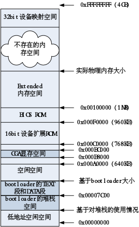

# 【实现】显示字符串

bootloader只在CPU和内存中打转无法让读者很容易知道bootloader的工作是否正常，为此在成功完成了保护模式的转换后，就需要通过显示字符串来展示一下自己了。bootloader设置好栈后，就可以调用bootmain函数显示字符串了。在proj1中使用了显示器和并口两种外设来显示字符串，主要的代码集中在bootmain.c中。

这里采用的是很简单的基于Programmed I/O （PIO）方式，PIO方式是一种通过CPU执行I/O端口指令来进行数据读写的数据交换模式，被广泛应用于硬盘、光驱等设备的基础传输模式中。这种I/O访问方式使用CPU I/O端口指令来传送所有的命令、状态和数据，需要CPU全程参与，效率较低，但编程很简单。后面讲到的中断方式将更加高效。
在bootmain.c中的lpt_putc函数完成了并口输出字符的工作。输出一个字符的流程（可参看bootmain.c中的lpc_putc函数实现）大致如下：

1. 读I/O端口地址0x379，等待并口准备好；
2. 向I/O端口地址0x378发出要输出的字符；
3. 向I/O端口地址0x37A发出控制命令，让并口处理要输出的字符。

在bootmain.c中的serial_putc函数完成了串口输出字符的工作。输出一个字符的流程（可参看bootmain.c中的serial_putc函数实现）大致如下：

1. 读I/O端口地址(0x3f8+5)获得LSR寄存器的值，等待串口输出准备好；
2. 向I/O端口地址0x3f8发出要输出的字符；

在bootmain.c中的cga_putc函数完成了CGA字符方式在某位置输出字符的工作。输出一个字符的流程（可参看bootmain.c中的cga_putc函数实现）大致如下：

1. 写I/O端口地址0x3d4，读I/O端口地址0x3d5，获得当前光标位置；
2. 在光标的下一位置的显存地址空间上写字符，格式是黑色背景/白色字符;
3. 设置当前光标位置为下一位置。

proj1启动后的PC机内存布局如下图所示：

自此，我们了解了一个小巧的bootloader的实现过程，但这还仅仅是百尺竿头的第一步，它还只能显示字符串，不能加载操作系统。我们还需要扩展bootloader的功能，让它能够加载操作系统。
