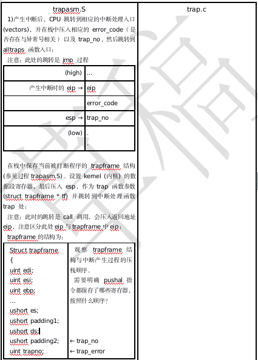

# 【实现】中断处理过程

当中断产生后，首先硬件要完成一系列的工作（如小节“中断处理中硬件负责完成的工作”所描述的“硬件中断处理过程1（起始）”内容），由于中断发生在内核态执行过程中，所以特权级没有变化，所以CPU在跳转到中断处理例程之前，还会在内核栈中依次压入错误码（可选）、EIP、CS和EFLAGS，下图显示了在相同特权级下中断产生后的栈变化示意图：

然后CPU就跳转到IDT中记录的中断号i所对应的中断服务例程入口地址处继续执行。 vector.S 文件中定义了每个中断的中断处理例程的入口地址 (保存在 vectors 数组中)。其中，中断可以分成两类：一类是压入错误编码的 (error code)，另一类不压入错误编码。对于第二类， vector.S 自动压入一个 0。此外，还会压入相应中断的中断号。在内核栈中压入一个或两个必要的参数之后，都会跳转到统一的入口 \__alltraps 处（位于trapentry.S中）继续执行。

CPU从_\_alltraps处开始，在栈中按照trapframe结构压入各个寄存器，此时内核栈的结构如下所示：

	uint32_t reg_edi;
	uint32_t reg_esi;
	uint32_t reg_ebp;
	uint32_t reg_oesp;			/* Useless */
	uint32_t reg_ebx;
	uint32_t reg_edx;
	uint32_t reg_ecx;
	uint32_t reg_eax;	
	uint16_t tf_es;
	uint16_t tf_padding1;
	uint16_t tf_ds;
	uint16_t tf_padding2;
	uint32_t tf_trapno;
	/* below here defined by x86 hardware */
	uint32_t tf_err;
	uintptr_t tf_eip;
	uint16_t tf_cs;
	uint16_t tf_padding3;
	uint32_t tf_eflags;
    
此时，为了将来能够恢复被打断的内核执行过程所需的寄存器内容都保存好了。为了正确进行中断处理，把DS和ES寄存器设置为GD_KDATA，这是为了预防从用户态产生的中断（当然，到目前为止，ucore都在内核态执行，还不会发生这种情况）。把刚才保存的trapframe结构的起始地址（即当前SP值）压栈，然后调用 trap函数（定义在trap.c中），就开始了对具体中断的处理。trap进一步调用trap_dispatch函数，完成对具体中断的处理。在相应的处理过程结束以后，trap将会返回，在\__trapret:中，完成对返回前的寄存器和栈的回复准备工作，最后通过iret指令返回到中断打断的地方继续执行。整个中断处理流程大致如下：

