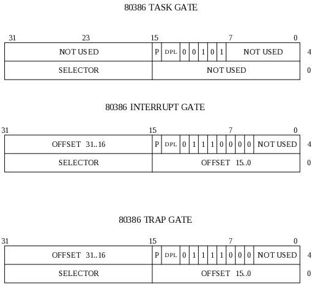
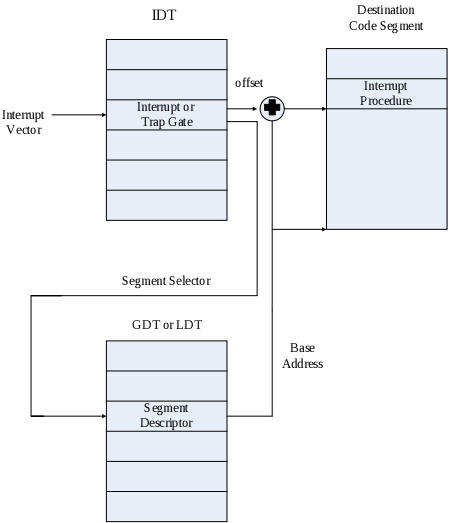
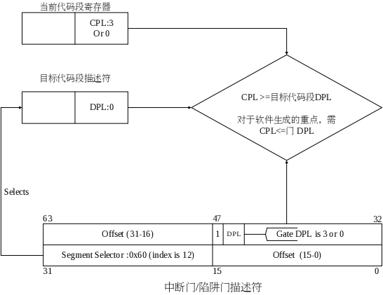

# 【背景】理解CPU对外设中断的硬件支持

操作系统需要对计算机系统中的各种外设进行管理，这就需要CPU和外设能够相互通信才行。一般外设的速度远慢于CPU的速度。如果让操作系统通过CPU“主动关心”外设的事件，即采用通常的轮询(polling)机制，则太浪费CPU资源了。所以需要操作系统和CPU能够一起提供某种机制，让外设在需要操作系统处理外设相关事件的时候，能够“主动通知”操作系统，即打断操作系统和应用的正常执行，让操作系统完成外设的相关处理，然后在恢复操作系统和应用的正常执行。在操作系统中，这种机制称为中断机制。中断机制给操作系统提供了处理意外情况的能力，同时它也是实现进程/线程抢占式调度的一个重要基石。但中断引入的不确定性和异步性导致了设计和实现操作系统更加困难。

本章只描述保护模式下的中断处理过程。当CPU收到外设中断（可通过可编程中断控制器芯片8259A发给CPU中断信息）、CPU自身产生的故障（Fault）或CPU自身“有意”产生的陷阱（trap）时，它会暂停执行当前的程序或任务，通过一定的机制跳转到负责处理这个事件的相关处理例程中，在完成对这个事件的处理后再跳回到刚才被打断的程序或任务中。中断向量和中断服务例程的对应关系主要是由IDT（中断门描述符表）来描述。操作系统在IDT中设置好各种中断向量对应的中断描述符，而中断描述符指出了中断服务例程的起始地址，留待CPU在产生中断后查询对应中断服务例程的起始地址。而IDT本身的起始地址保存在IDTR寄存器中。

80386共支持256种中断，其中故障（Fault）和陷阱(Trap)由CPU自身产生，不使用中断控制器，也不能被屏蔽。外设中断又分为可屏蔽中断（INTR）和非屏蔽中断（NMI），I/O设备产生的中断请求（IRQ）引起可屏蔽中断，而紧急的外设事件（如掉电故障）引起的中断事件引起非屏蔽中断。

非屏蔽中断和异常的编号是固定的，而屏蔽中断的编号可以通过对中断控制器的编程来调整。256个中断的分配如下：
* 0~31号的中断对应于故障、陷阱和非屏蔽外设中断。
* 32~47号的中断分配给可屏蔽外设中断。
* 48~255号的中断可以用软件来设置。比如ucore可用其中的一个中断号来实现系统调用。

## 外设可屏蔽中断

80386通过两片中断控制器8259A来响应15个外中断源，每个8259A可管理8个中断源。第一级（称主片）的第二个中断请求输入端，与第二级8259A（称从片）的中断输出端INT相连，如下图所示。IRQ号和中断号之间的映射关系可以通过中断控制器来调整。

级联的 8259A架构
___

在中断产生过程中，中断控制器8259A监视外设产生的中断请求（IRQ）信号，如果外设产生了一个中断请求信号，则8259A执行如下操作：

1.  把接受到的IRQ信号转换成一个对应的中断编号；
1. 把这个中断编号值存放在中断控制器的一个I/O地址单元中，CPU通过数据/地址总线可访问到此I/O地址单元；
1. 给CPU的INTR引脚触发信号，即发出一个中断；
1. 等待直到CPU通过INTA引脚确认这个中断信号，清除INTR引脚上的触发信号。

屏蔽外部I/O请求有两种方法。一种是从CPU的角度清零CPU的EFLAG的中断标志位（IF）；另一种是从中断控制器的角度，即通过把中断控制器中的中断屏蔽寄存器（IMR）相应位置1，则表示禁用某条中断线。

## 陷阱、故障和非屏蔽中断

陷阱和故障是CPU内部执行指令的过程中产生的中断事件。非屏蔽中断就是计算机内部硬件出错时引起的紧急故障情况。80386处理器发布了大约20种陷阱、故障或非屏蔽中断。在某些故障产生时，CPU会产生一个硬件错误码并压入内核栈中。

在下表中给出了在实验中可能碰到的80386中陷阱的中断号、名称、类别及简单描述。更多的信息可以在Intel的技术文挡中找到。

表 ucore中异常的简单描述
<table broder='1'>
<tr>
	<td>中断号</td>
    <td>名称</td>
  	<td>类别</td>
 	<td>简单描述</td>
</tr>
<tr>
	<td>8</td>
    <td>双重故障</td>
  	<td>故障</td>
 	<td>在处理故障中又产生了故障</td>
</tr>
<tr>
	<td>11</td>
    <td>段不存在</td>
  	<td>故障</td>
 	<td>访问一个不存在的段</td>
</tr>
<tr>
	<td>12</td>
    <td>栈段异常</td>
  	<td>故障</td>
 	<td>超过栈段界限，或由ss标识的段不存在</td>
</tr>
<tr>
	<td>13</td>
    <td>通用保护</td>
  	<td>故障</td>
 	<td>违反了保护模式下的某种保护规则</td>
</tr>
<tr>
	<td>14</td>
    <td>页异常</td>
  	<td>故障</td>
 	<td>页不在内存，或违反了一种分页保护机制</td>
</tr>
</table>

## 中断门描述符表（Interrupt Descriptor Table）

中断门描述符表把每个中断或异常编号和一个指向中断服务例程的描述符联系起来。同GDT一样，IDT是一个8字节的描述符数组，但IDT的第一项可以包含一个描述符。CPU把中断（异常）号乘以8做为IDT的索引。IDT可以位于内存的任意位置，CPU通过IDT寄存器（IDTR）的内容来寻址IDT的起始地址。指令LIDT和SIDT用来操作IDTR。两条指令都有一个显示的操作数：一个6字节表示的内存地址。指令的含义如下：
* LIDT（Load IDT Register）指令：使用一个包含线性地址基址和界限的内存操作数来加载IDT。操作系统创建IDT时需要执行它来设定IDT的起始地址。这条指令只能在特权级0执行。
* SIDT（Store IDT Register）指令：拷贝IDTR的基址和界限部分到一个内存地址。这条指令可以在任意特权级执行。

IDT和IDTR寄存器的结构和关系如下图所示：

在保护模式下，最多会存在256个Interrupt/Exception Vectors。范围[0，31]内的32个向量被故障中断和NMI（不可屏蔽）中断使用，但当前并非所有这32个向量都已经被使用，有几个当前没有被使用。范围[32，255]内的向量被保留给用户定义的中断，可将它们用作外部I/O设备中断（8259A IRQ），或者系统调用（System Call 、Software Interrupts）等。 

## 门描述符（Gate Descriptors）

在保护模式下，中断门描述符表（IDT）中的每个表项由8个字节组成，其中的每个表项叫做一个门描述符（Gate Descriptor）， “门”的含义是指当中断发生时必须先访问这些“门”，能够“开门”（即将要进行的处理需通过特权检查，符合设定的权限等约束）后，然后才能进入相应的处理程序。而门描述符则描述了“门”的属性（如特权级、段内偏移量等）。在IDT中，可以包含如下3种类型的系统段描述符：

* 中断门描述符（Interrupt-gate descriptor）： 用于中断处理，其类型码为110，中断门包含了一个外设中断或故障中断的处理程序所在段的选择子和段内偏移量。当控制权通过中断门进入中断处理程序时，处理器清IF标志，即关中断，以避免嵌套中断的发生。中断门中的DPL（Descriptor Privilege Level）为0，因此用户态的进程不能访问中断门。所有的中断处理程序都由中断门激活，并全部限制在内核态。
* 陷阱门描述符（Trap-gate descriptor）：用于系统调用，其类型码为111，与中断门类似，其唯一的区别是，控制权通过陷阱门进入处理程序时维持IF标志位不变，也就是说，不关中断。
* 任务门描述符（Task-gate descriptor）和调用门描述符（Call-gate descriptor）: 这两种主要是Intel设置的“任务”切换的手段，在本书中暂时没有使用。

下图图显示了80386的中断门描述符、陷阱门描述符的格式：

## 中断处理中硬件负责完成的工作

中断服务例程包括具体负责处理中断（异常）的代码是操作系统的重要组成部分。需要注意区别的是，有两个过程由硬件完成：
* 硬件中断处理过程1（起始）：从CPU收到中断事件后，打断当前程序或任务的执行，根据某种机制跳转到中断服务例程去执行的过程。其具体流程如下：

    1. CPU在执行完当前程序的每一条指令后，都会去确认在执行刚才的指令过程中中断控制器（如8259A）是否发送中断请求过来，如果有那么CPU就会在相应的时钟脉冲到来时从总线上读取中断请求对应的中断向量；
    2. CPU根据得到的中断向量（以此为索引）到IDT中找到该向量对应的中断描述符，中断描述符里保存着中断服务例程的段选择子；
    3. CPU使用IDT查到的中断服务例程的段选择子从GDT中取得相应的段描述符，段描述符里保存了中断服务例程的段基址和属性信息，段描述符的基址+中断描述符中的偏移地址形成了中断服务例程的起始地址；
    4. CPU会根据CPL和中断服务例程的段描述符的DPL信息确认是否发生了特权级的转换。比如当前应用程序正运行在用户态，而中断服务例程是运行在内核态的，则意味着发生了特权级的转换，这时CPU会从当前应用程序的TSS信息（该信息在内存中的起始地址存在TR寄存器中）里取得该程序的内核栈地址，即包括内核态的ss和esp的值，并立即将系统当前使用的栈切换成新的内核栈。这个栈就是即将运行的中断服务程序要使用的栈。紧接着就将当前程序使用的用户态的ss和esp压到新的内核栈中保存起来；如果当前程序运行在内核态，则不会发生特权转移
    5. CPU需要开始保存当前被打断的用户态程序的现场（即一些寄存器的值），以便于将来恢复被打断的程序继续执行。这需要利用内核栈来保存相关现场信息，即依次压入当前被打断程序使用的eflags，cs，eip，errorCode（如果是有错误码的异常）信息；
    6. CPU把中断服务例程的地址加载到cs和eip寄存器中，开始执行中断服务例程。这意味着先前的程序被暂停执行，中断服务程序正式开始工作。

* 硬件中断处理过程2（结束）：每个中断服务例程在有中断处理工作完成后需要通过iret（或iretd）指令恢复被打断的程序的执行。CPU执行IRET指令的具体过程如下：

    1. 程序执行这条iret指令时，首先会从内核栈里弹出先前保存的被打断的程序的现场信息，即eflags，cs，eip重新开始执行；
    2. 如果存在特权级转换（从内核态转换到用户态），则还需要从内核栈中弹出用户态栈的ss和esp，这样也意味着栈也被切换回原先使用的用户态的栈了；
    3. 如果此次处理的是带有错误码（errorCode）的异常，CPU在恢复先前程序的现场时，并不会弹出errorCode。这一步需要通过软件完成，即要求相关的中断服务例程在调用iret返回之前添加出栈代码主动弹出errorCode。

下图显示了从中断向量到GDT中相应中断服务程序起始位置的定位方式：

## 中断处理的特权级转换

中断处理得特权级转换是通过门描述符（gate descriptor）和相关指令来完成的。一个门描述符就是一个系统类型的段描述符，一共有4个子类型：调用门描述符（call-gate descriptor），中断门描述符（interrupt-gate descriptor），陷阱门描述符（trap-gate descriptor）和任务门描述符（task-gate descriptor）。与中断处理相关的是中断门描述符和陷阱门描述符。这些门描述符被存储在中断门描述符表（Interrupt Descriptor Table，简称IDT）当中。CPU把中断向量作为IDT表项的索引，用来指出当中断发生时使用哪一个门描述符来处理中断。中断门描述符和陷阱门描述符几乎是一样的。中断发生时实施特权检查的过程如下图所示：

图 中断发生时实施特权检查的过程

门中的DPL和段选择符一起控制着访问，同时，段选择符结合偏移量（Offset）指出了中断处理例程的入口点。内核一般在门描述符中填入内核代码段的段选择子。产生中断后，CPU一定不会将运行控制从高特权级转向低特权级，特权级必须要么保持不变（当操作系统内核自己被中断的时候），或被提升（当用户态程序被中断的时候）。无论哪一种情况，作为结果的CPL必须等于目的代码段的DPL。如果CPL发生了改变（比如从用户态到内核态），一个栈切换操作（通过TSS完成）就会发生。如果中断是被用户态程序中的指令所触发的（比如软件执行INT n生产的中断），还会增加一个额外的检查：门的DPL必须具有与CPL相同或更低的特权。这就防止了用户代码随意触发中断。如果这些检查失败，就会产生一个一般保护异常（general-protection exception）。