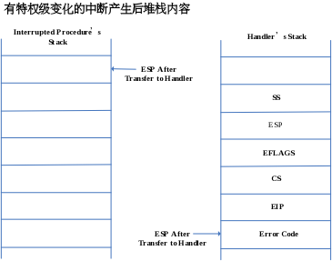

# 【实现】内核态切换到用户态

在kern/init.c中的switch_test函数完成了内核态<-->用户态之间的切换。内核态切换到用户态是通过swtich_to_user函数，执行指令“int T_SWITCH_TOU”。当CPU执行这个指令时，由于是在switch_to_user执行在内核态，所以不存在特权级切换问题，硬件只会在内核栈中压入Error Code（可选）、EIP、CS和EFLAGS（如下图所示），然后跳转到到IDT中记录的中断号T_SWITCH_TOU所对应的中断服务例程入口地址处继续执行。通过2.3.7小节“中断处理过程”可知，会执行到trap_disptach函数（位于trap.c）：

    case T_SWITCH_TOU:
    if (tf->tf_cs != USER_CS) {
    //当前在内核态，需要建立切换到用户态所需的trapframe结构的数据switchk2u
    switchk2u = *tf;
    switchk2u.tf_cs = USER_CS;
    switchk2u.tf_ds = switchk2u.tf_es = switchk2u.tf_ss = USER_DS;
    switchk2u.tf_esp = (uint32_t)tf + sizeof(struct trapframe) - 8;
       //设置EFLAG的I/O特权位，使得在用户态可使用in/out指令
    switchk2u.tf_eflags |= (3 << 12);
        //设置临时栈，指向switchk2u，这样iret返回时，CPU会从switchk2u恢复数据，
    //而不是从现有栈恢复数据。
        *((uint32_t *)tf - 1) = (uint32_t)&switchk2u;
    }
  
这样在trap将会返回，在\__trapret:中，根据switchk2u的内容完成对返回前的寄存器和栈的回复准备工作，最后通过iret指令，CPU返回“int T_SWITCH_TOU”的后一条指令处，以用户态模式继续执行。

