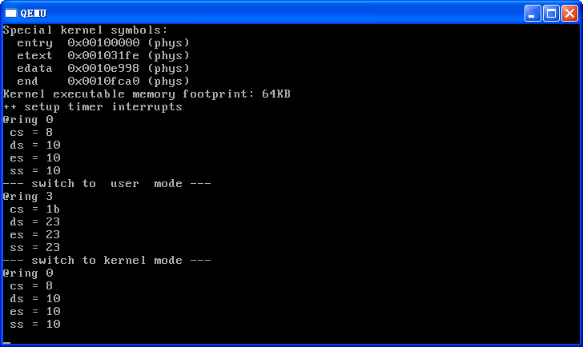

# 可在内核态和用户态之间进行切换的ucore 

在操作系统原理中，一直强调操作系统运行在内核态（特权态），应用程序运行在用户态（非特权态）。但为什么说处于用户态的应用程序就不能访问内核态的数据，而内核态的操作系统可以访问用户态的数据？我们有没有一个project来体验内核态和用户态的区别是什么？更进一步体验如何在内核态和用户态之间进行切换呢？project4.1.1为此进行了尝试。 

##实验目标

通过学习和实践，读者可以了解如何CPU处不同特权态下的执行特点和限制，理解如何从内核态切换到用户态，以及如何从用户态切换到内核态。

##proj4.1.1概述

###实现描述

proj4.1.1建立在proj4.1（当然是基于proj4）基础之上，主要完成了用户态（非特权态）与内核态相互切换的过程。相对于proj4，主要增加了两部分工作，一部分是从用户态返回内核态的准备工作，即建立任务段（Task Segment）和任务段描述符（SEG\_TSS），设置陷阱中断号（T\_SWITCH\_TOK）和对应的中断处理例程。另外一部分是对内核栈进行各种特殊处理，使得能够完成内核态切换到用户态或用户态切换到内核态的工作。

### 项目组成

这里我们通过proj4.1.1来完成此事。proj4.1.1整体目录结构如下所示：

    proj4.1.1
    |-- kern
    |   |-- init
    |   |   `-- init.c
    |   |-- mm
    |   |   |-- memlayout.h
    |   |   |-- mmu.h
    |   |   |-- pmm.c
    |   |   `-- pmm.h
    |   `-- trap
    |       |-- trap.c
    |       |-- trapentry.S
    |       |-- trap.h
    |       `-- vectors.S
    ……

相对于proj4，改动不多，主要修改和增加的文件如下：

* memlayout.h：定义了全局描述符的索引值和一些段描述符的属性。
* pmm.[ch]：为了能够使CPU从用户态转换到内核态，在ucore初始化时，设置任务段和任务段描述符，重新加载任务段和段描述符表；
* trap.c：设置自定义的陷阱中断T\_SWITCH\_TOK（用于用户态切换到内核态）和实现对自定义的陷阱中断T\_SWITCH\_TOK/T\_SWITCH\_TOU的中断处理例程，使得CPU能够在内核态和用户态之间切换。

### 编译运行

编译并运行proj4.1.1的命令如下：

    make
    make qemu
  
则可以得到如下显示界面

通过上图，我们可以看到ucore在切换到用户态之前，先显示了当前CPU的特权级（CS的最低两位），CS/DS/ES/SS的值（即对应的段描述符表的索引值），可以看到特权级为0。根据lgdt函数（位于kern/mm/pmm.c中）的处理，CS的值是内核代码段描述符的索引下标，DS/ES/SS的值是内核数据段描述符的索引下标；而在切换到用户态后，又显示了一下，当前CPU的特权级为3， CS的值为1b，DS/ES/SS的值为23，把这四个寄存器的值&0xfc，则分别为0x18（SEG_UTEXT）和0x20（SEG_UDATA），说明确实运行在用户态了。在执行了系统调用T_SWITCH_TOK后，又回到了内核态。下面我们将分析到底发生了什么事情。

