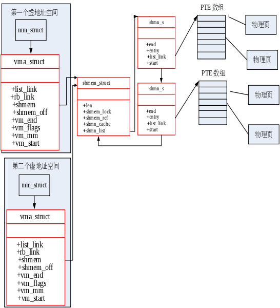

# proj9.1：实现共享内存

实现共享内存功能的目的是为将来（lab5中才需要）不同进程（process）之间能够通过共享内存实现数据共享。共享内存机制其实是一种进程间通信的手段。proj9/proj9.1完成了不同页表中（目前仅局限于父子进程之间,lab3才涉及）的虚拟地址共享同一块物理地址空间的功能。由于目前的实现仅限于有亲属关系的进程，这实际上意味着这些具有共享物理地址空间的虚拟地址空间也是相同的。

## 相关数据结构

这部分的具体实现工作主要在kern/mm/shmem.[ch]和其他一些文件中。根据前面的分析，我们知道在mm_struct 层面上管理了基于同一个页表的vma集合，这些集合表示了当前可“合法”使用（即使没有对应的物理内存）的所有虚拟地址空间集合。当前的vma_struct定义如下：

    struct vma_struct {
        struct mm_struct *vm_mm;
        uint32_t vm_start;
        uint32_t vm_end;
        uint32_t vm_flags;
        vma_entry_t vma_link;
    };

这 个是proj9.1以前的 vma_struct 结构定义。由于vma中并没有描述此虚拟地址对应的物理地址空间，所以无法确保不同页表中描述同一虚拟地址空间的vma指向同一个物理地址空间，所以不同页表间的内存无法实现共享。于是我们可以对vma_struct增加下面两个域（field）：

    struct shmem_struct *shmem;
    size_t shmem_off;
  
shmem的作用是统一维护不同mm_struct结构（即不同页表）中描述具有共享属性的同一虚拟地址空间的唯一物理地址空间。如果 vma->flags 里面有 VM_SHARE，就表示 vma->shmem 有意义，他指向一个 shmem_struct结构的指针。shmem_struct结构定义如下：

    struct shmem_struct {
        list_entry_t shmn_list;
        shmn_t *shmn_cache;
        size_t len;
        atomic_t shmem_ref;
        lock_t shmem_lock;
    };

shmem_struct包含了list_entry_t结构的shmn_list，此链表的元素是shmn_t结构的共享页描述（包含某共享虚拟页的信息（page 或者 swap entry），为了维护起来简便，里面借用了页表的PTE描述方式，除了 PTE_P 用来区分是否是一个物理页以外，没有任何其它权限标记，所以后面提到的 PTE 应该是带引号的），所以此链表就是用来存储虚拟地址空间的PTE集合，即此共享的虚拟地址空间对应的唯一的物理地址空间的映射关系。shmem_ref指出了当前有多少进程共享此共享虚拟空间。shmn_t是用来描述一段共享虚拟空间的信息，可理解为一个shmem node结构，其定义如下：

    typedef struct shmn_s {
        uintptr_t start;
        uintptr_t end;
        pte_t *entry;
        list_entry_t list_link;
    } shmn_t;

在这个结构中，entry保存了一块（4KB）连续的虚拟空间的PTE数组，可以理解为一个二级页表，这个页表最大可以描述4MB的连续虚拟空间对应的物理空间地址信息。entry 中的每一项用于保存 physical address | PTE_P 或者 swap_entry。这样能最大限度节约内存，并且能很快通过entry项计算出 对应的struct page。
而list_link是用来把自身连接属于同一shmem_struct结构的域-shmn_list链表，便于shmem_struct结构的变量对共享空间进行管理。这样就可以形成如下图所示的共享内存布局：

## 创建和访问共享内存的实现逻辑

为了创建一块共享内存，首先需要在内核中调用do_shmem函数(此函数要到lab3的proj12才会出现)，do_shmem函数并进一步调用shmem_create函数创建一个shmem_struct结构的变量，然后再调用mm_map_shmem函数来创建一个vma结构的变量，并设置vma的属性为VM_SHARE，并把vma->shmem指向shmem结构变量。这样就初步建立好了一个共享内存虚拟空间。

由于并没有给这块共享内存虚拟空间实际分配物理空间，所以在第一次访问此vma中某地址时，会产生缺页异（page fault ），并触发do_pgfault函数被调用。此函数如果发现是“合法”的共享内存虚拟空间出现的地址访问错时，将调用shmem的处理函数shmem_get_entry，来查找此共享内存虚拟子空间所在的其他虚拟地址空间中（具有不同的页表）是否此虚地址对应的PTE项存在，如果不存在，则表明这是第一次访问这个共享内存区域，就可以创建一个物理页，并在shmn_s的entry中记录虚拟页与物理页的映射关系；如果存在，则在本虚拟地址空间中建立此虚地址对应的PTE项，这样就可以确保不同页表中的共享虚拟地址空间共享一个唯一的物理地址空间。

shmem结构中增加一个计数器，在执行复制某虚拟地址空间的copy_mm函数的时，如果 vm_flags 有 VM_SHARE，则仅增加 shmem 计数器shmem_ref，而不用再创建一个shmem变量；同理，释放 具有共享内存属性的vma 时，应该减少shmem计数器shmem_ref，当shmem计数器shmem_ref减少到0的时候，应该释放 shmem 所占有的资源。

另外，在shmem 里面不能记录地址，因为不同 vma 可能map到不同的地址上去，因此它只维护一个 page 的大小。上面提到的 shmem_off 的作用是定位页面。具有共享属性的 vma 创建的时候，shmem_off = 0。当 vma->vm_start 增加的时候（只可能变大，因为内核不支持它减小，unmap 的时候可能导致 vma 前面部分的 unmap，这就可能会让 vm_start 变大），应该将 vm_start 的增量赋给 shmem_off，以保证剩下的 shmem 能够访问正确的位置。这样在访问共享内存地址addr发生缺页异常的时候，此地址对应的页在 shmem_struct 里面的 PTE数组项的索引index 应该等于 (addr - vma->vm_start + vma->shmem_off) / PGSIZE

**【注意】**

在页换出操作中， 尝试换出一页的条件是页的 page_ref 到 0。为了防止 share memory 的 page 被意外的释放掉，shmem 结构也会增加相应数据页的引用计数。那么对于一个share memory 的数据页，是不是就不能换出了？前面提到，页换出操作的第一步是扫描所有的虚拟地址空间，那么页换出操作就完全有能力知道当前扫描的 vma 是普通的 vma 还是对应的 share memory 的vma。正如 swap.c 里面看到的那样，swap 断开一个 page 以后，如果发现当前 vma 是share memory 的，并且 page_ref 是1，那么可以确定的是这个最后一个 page_ref 是在 shmem 结构中。那么swap 也同时将该 share memory 上的PTE 断开，就满足了 page_launder 的换出条件。

share memory 上的 entry 换成了 swap entry 带来的坏处也很明显，因为标记share 的 vma 如果一开始没有页表内容，需要通过 #PF 从shmem 里面得到相应的 PTE。但是不幸的是，得到的是 swap entry，那么只能再通过第二次 #PF，才能将swap entry 替换成数据页。
