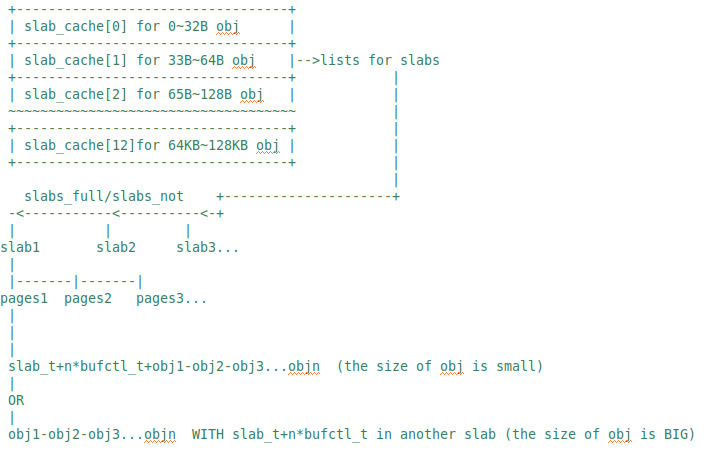

# 【实现】slab算法的简化设计实现 

## 数据结构描述

slab 算法采用了两层数据组织结构。在最高层是 slab_cache，这是一个不同大小slab 缓存的链接列表数组。slab_cache的每个数组元素都是一个管理和存储给定大小的空闲对象（obj）的slab 结构链表，这样每个slab设定一个要管理的给定大小的对象池，占用物理空间连续的1个或多个物理页。slab_cache的每个数组元素管理两种slab列表：

- slabs_full：完全分配的 slab 
- slabs_notfull：部分分配的 slab

注意 slabs_notfull列表中的 slab 是可以进行回收（reaping），使得slab 所使用的内存可被返回给操作系统供其他子系统使用。

slab 列表中的每个 slab 都是一个连续的内存块（一个或多个连续页），它们被划分成一个个obj。这些obj是中进行分配和释放的基本元素。由于对象是从 slab 中进行分配和释放的，因此单个 slab 可以在 slab 链表之间进行移动。例如，当一个 slab 中的所有对象都被使用完时，就从 slabs_notfull 链表中移动到 slabs_full 链表中。当一个 slab 完全被分配并且有对象被释放后，就从 slabs_full 列表中移动到 slabs_notfull列表中。下面是ucore中的slab架构图：

slab架构图

## 分配与释放内存实现描述

现在来看一下能够创建新 slab 缓存、向缓存中增加内存、销毁缓存的接口以及 slab 中对对象进行分配和释放操作的slab相关操作过程和函数。

第一个步骤是通过执行slab_init函数初始化slab_cache 缓存结构。然后其他 slab 缓存函数将使用该引用进行内存分配与释放等操作。ucore中最常用的内存管理函数是 kmalloc 和 kfree 函数。这两个函数的原型如下：

- void *kmalloc( size_t size );
- void kfree(void *objp );

在分配任意大小的空闲块时，kmalloc通过调用kmem_cache_alloc函数来遍历对应size的slab，来查找可以满足大小限制的缓存。如果kmem_cache_alloc函数发现slab中有空闲的obj，则分配这个对象；如果没有空闲的obj了，则调用kmem_cache_grow函数分配包含1到多页组成的空闲slab，然后继续分配。要使用 kfree 释放对象时，通过进一步调用kmem_cache_free把分配对象返回到slab中，并标记为空闲，建立空闲obj之间的链接关系。

`（可进一步详细一些）`