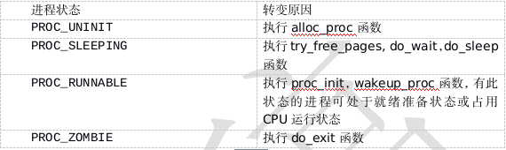

# 进程运行状态转变过程

分析完从进程/线程从创建到退出的整个过程，我们需要在从全局的角度来看看进程/线程在做整个运行过程中的运行状态转变过程。在执行状态转变过程中，ucore在调度过程总，并没有区分线程和进程，所以进程和线程的执行状态转变是一致的，分析的结果适合用户线程和用户进程的执行过程。

首先为了描述进程/线程的整个状态集合，ucore在kern/process/proc.h中定义了进程/线程的运行状态：

    // process's state in his life cycle
    enum proc_state {
        PROC_UNINIT = 0,  // uninitialized
        PROC_SLEEPING,    // sleeping
        PROC_RUNNABLE,    // runnable(maybe running)
        PROC_ZOMBIE,      // almost dead, and wait parent proc to reclaim his resource
    };

这与操作系统原理讲解的五进程执行状态相比，少了一个PROC_RUNNING态（表示正在占用CPU执行），这是由于在ucore中，用current（基于proc_strcut数据结构）进程控制块指针指向了当前正在运行的进程/线程PROC_RUNNING态，所以就没必要再增加一个PROC_RUNNING态了。那么那些事件或内核函数会触发状态的转变呢？通过分析uore源码，我们可以得到如下表示：

当父进程得到子进程的通知，回收完子进程控制块所占内存后，这个进程就彻底消失了。我们也可以用一个类似有限状态自动机来表示状态的变化：`（需要用visio重画）`

    process state changing:

      alloc_proc                                 RUNNING
          +                                   +--<----<--+
          +                                   + proc_run +
          V                                   +-->---->--+ 
    PROC_UNINIT -- proc_init/wakeup_proc --> PROC_RUNNABLE -- try_free_pages/do_wait/do_sleep --> PROC_SLEEPING --
                                               A      +                                                           +
                                               |      +--- do_exit --> PROC_ZOMBIE                                +
                                               +                                                                  + 
                                               -----------------------wakeup_proc----------------------------------

