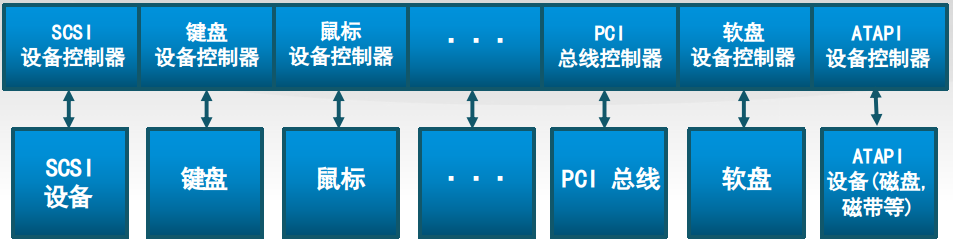

# 计算机硬件架构

这里介绍一下运行操作系统的基本计算机硬件架构。一台计算机可抽象为CPU、内存和 I/O 设备。CPU\(中央处理器，也称处理器\) 执行ucore中的指令，完成相关计算和读写内存，物理内存保存了ucore中的指令和需要处理的数据，外部设备用于实现ucore的输入（键盘、硬盘），输出（显示器、并口、串口），计时（时钟）永久存储（硬盘）。

## CPU

CPUs是计算机系统的核心，从一加电开始，按照取指令，执行指令的循环周而复始地运行。取指令的过程即从某寄存器（比如，程序计数器）中获取一个内存地址，从这个内存地址中读入指令，执行机器指令，不断重复，CPU运行期间会有分支和调用指令来修改程序计数器，否则程序计数器就自动加１，让CPU从下一个内存地址单元取指令，并继续执行。

## 内存层次

计算机中有多种存放数据和指令代码的单元，比如在CPU内的寄存器（register）、高速缓存\(cache\)、内存（memory）、硬盘、磁带等。寄存器访问速度最快但成本昂贵，在80386处理器中只有十个左右的通用寄存器；高手缓存（cache）  一般也在CPU内部,cache是内存和寄存器在速度和大小上的折衷，比寄存器慢2~10倍，容量也有限，量级大约几百KB到几十MB不等；再接下来就是内存了，内存位于CPU外，比寄存器慢10倍以上，但容量大，目前一般以GB到几百GB不等；硬盘一般比寄存器要慢1000倍以上，但掉电后其存储的数据不会丢失。由于寄存器、cache、内存、硬盘在读写速度和容量上的巨大差异，所以需要操作系统来协调数据的访问，尽量主动协助应用软件，把最近访问的数据放到寄存器或cache中（实际上操作系统不能直接控制cache的读写），把经常访问的数据放在内存中，把不常用的数据放到硬盘上，这样可以达到让多个运行的应用程序“感觉”到它可用使用很大的空间，也可有很快的访问速度。

## I/O

上图总中给出了一个通常PC计算机的硬件架构图，包括了各种复杂的外设硬件。在后续的讲解中，本书不会涉及很多复杂具体硬件，而只涉及到ucore用到的一些基本的硬件细节。ucore和应用程序需要有输入和输出，否则没东西要处理或者执行完了无法把结果反馈给用户。ucore要处理的数据需要从外设（比如键盘或硬盘）中获得，且在处理完毕后要传给外设（比如显示器和硬盘）进一步处理。ucore如何高效地管理外设？一般而言，ucore可以通过轮循、中断、DMA等方式来完成CPU有外设直接的交互。在x86中有两条特殊的 `in`和`out` 指令来在完成CPU对外设地址空间的访问，实现对外设的管理控制，也可以通过外设映射的_内存_来用通常的内存读写指令来管理设备。应用程序如果直接访问外设，会有代码实现复杂，可移植性差，无法有效并发等问题，所以如何简化外设访问的复杂性也是需要ucore来管理和协调。

