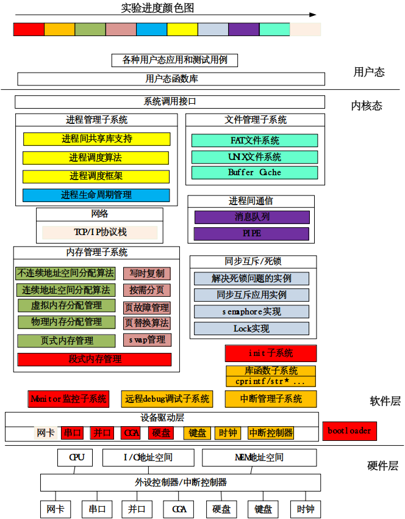

# ucore简介

ucore目前支持的硬件环境是基于Intel 80386以上的计算机系统。更多的硬件相关内容（比如保护模式等）将随着实现ucore的过程逐渐展开介绍。那我们准备如何一步一步实现ucore呢？安装一个操作系统的开发过程，我们可以有如下的开发步骤：

 1. bootloader+toy ucore：理解操作系统启动前的硬件状态和要做的准备工作，了解运行操作系统的外设硬件支持，操作系统如何加载到内存中，理解两类中断--“外设中断”，“陷阱中断”，内核态和用户态的区别；
 2. 物理内存管理：理解x86分段/分页模式，了解操作系统如何管理物理内存；
 3. 虚拟内存管理：理解OS虚存的基本原理和目标，以及如何结合页表+中断处理（缺页故障处理）来实现虚存的目标，如何实现基于页的内存替换算法和替换过程；
 4. 内核线程管理：理解内核线程创建、执行、切换和结束的动态管理过程，以及内核线程的运行周期等；
 5. 用户进程管理：理解用户进程创建、执行、切换和结束的动态管理过程，以及在用户态通过系统调用得到内核中各种服务的过程；
 6. 处理器调度：理解操作系统的调度过程和调度算法；
 7. 同步互斥与进程间通信：理解同步互斥的具体实现以及对系统性能的影响，研究死锁产生的原因，如何避免死锁，以及线程/进程间如何进行信息交换和共享；
 8. 文件系统：理解文件系统的具体实现，与进程管理和内存管理等的关系，缓存对操作系统IO访问的性能改进，虚拟文件系统（VFS）、buffer cache和disk driver之间的关系。

其中每个开发步骤都是建立在上一个步骤之上的，就像搭积木，从一个一个小木块，最终搭出来一个小房子。在搭房子的过程中，完成从理解操作系统原理到实践操作系统设计与实现的探索过程。这个房子最终的建筑架构和建设进度如下图所示
>  （！可进一步标注处各个proj在下图中的位置）

